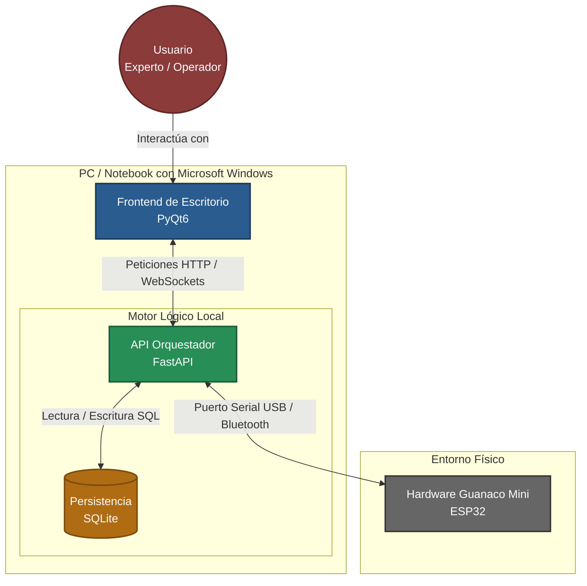

```mermaid
flowchart TD
    %% Definición de estilos
    classDef frontend fill:#2b5c8f,stroke:#1a3a5c,stroke-width:2px,color:#fff
    classDef backend fill:#278f56,stroke:#175c35,stroke-width:2px,color:#fff
    classDef database fill:#b06c13,stroke:#7a4a0c,stroke-width:2px,color:#fff
    classDef hardware fill:#666666,stroke:#333333,stroke-width:2px,color:#fff
    classDef user fill:#8c3b3b,stroke:#5c2424,stroke-width:2px,color:#fff

    Actor((Usuario\nExperto / Operador)):::user

    subgraph Entorno Cliente [PC / Notebook con Microsoft Windows]
        UI[Frontend de Escritorio\nPyQt6]:::frontend
        
        subgraph Motor Lógico Local
            API[API Orquestador\nFastAPI]:::backend
            DB[(Persistencia\nSQLite)]:::database
        end
    end

    subgraph Entorno Físico
        ESP[Hardware Guanaco Mini\nESP32]:::hardware
    end

    %% Relaciones y Flujos de Información
    Actor -->|Interactúa con| UI
    UI <-->|Peticiones HTTP / WebSockets| API
    API <-->|Lectura / Escritura SQL| DB
    API <-->|Puerto Serial USB / Bluetooth| ESP
```
