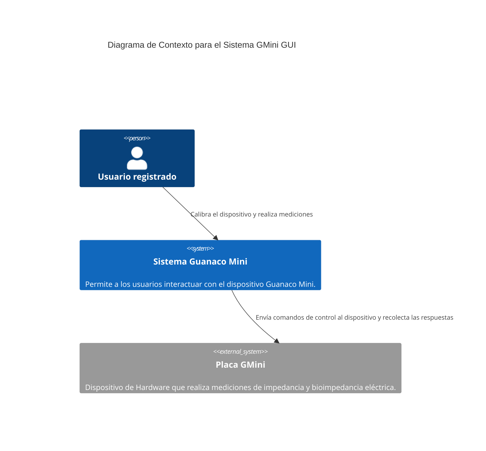
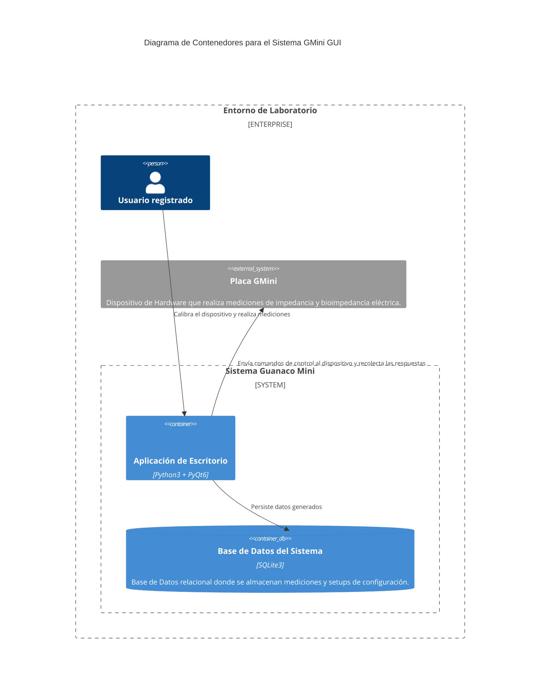
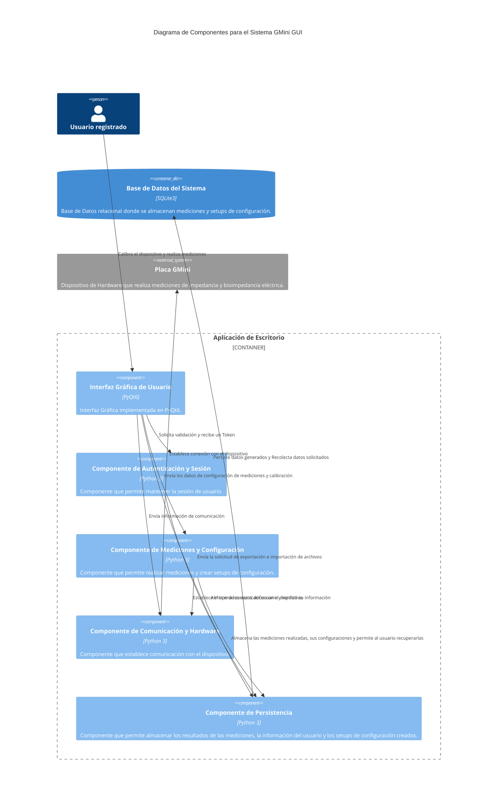

## HERRAMIENTAS UTILIZADAS
### Diagramas de Arquitectura de Software
#### Diagrama de Contexto

```mermaid
C4Context

title Diagrama de Contexto para el Sistema GMini GUI
Person(user, "Usuario registrado")

System(GMini-GUI, "Sistema Guanaco Mini", "Permite a los usuarios interactuar con el dispositivo Guanaco Mini.")

System_Ext(ESP32, "Placa GMini", "Dispositivo de Hardware que realiza mediciones de impedancia y bioimpedancia eléctrica.")

Rel(user, GMini-GUI, "Calibra el dispositivo y realiza mediciones")
Rel(GMini-GUI, ESP32, "Envía comandos de control al dispositivo y recolecta las respuestas")
```

#### Diagrama de Contenedores

```mermaid
C4Container

title Diagrama de Contenedores para el Sistema GMini GUI

Enterprise_Boundary(LEAB, "Entorno de Laboratorio") {

Person(user, "Usuario registrado")

System_Boundary(sys_gmini, "Sistema Guanaco Mini"){

Container(app, "Aplicación de Escritorio", "Python3 + PyQt6" ,"Provee la interfaz gráfica de usuario y la lógica de negocio para interactuar con el Hardware.")

ContainerDb(sqlite, "Base de Datos del Sistema", "SQLite3", "Base de Datos relacional donde se almacenan mediciones y setups de configuración.")

}

System_Ext(ESP32, "Placa GMini", "Dispositivo de Hardware que realiza mediciones de impedancia y bioimpedancia eléctrica.")

}

Rel(user, app, "Calibra el dispositivo y realiza mediciones")
Rel(app, sqlite, "Persiste datos generados")
Rel(app, ESP32, "Envía comandos de control al dispositivo y recolecta las respuestas")
```
#### Diagrama de Componentes

```mermaid
C4Component
title Diagrama de Componentes para el Sistema GMini GUI

%% Configuración opcional para dar más respiro horizontal
UpdateLayoutConfig($c4ShapeInRow="3", $c4BoundaryInRow="1")

Person(user, "Usuario registrado")

Container_Boundary(app, "Aplicación de Escritorio"){
    Component(UI, "Interfaz Gráfica de Usuario", "PyQt6", "Interfaz Gráfica implementada en PyQt6.")
    
    %% Capa de Servicios
    Component(sesion, "Componente de Autenticación y Sesión", "Python 3", "Componente que permite mantener la sesión de usuario.")
    Component(mediciones, "Componente de Mediciones y Configuración", "Python 3", "Componente que permite realizar mediciones y crear setups de configuración.")
    Component(comunicacion, "Componente de Comunicación y Hardware", "Python 3", "Componente que establece comunicación con el dispositivo.")
    
    %% Capa de Persistencia
    Component(persistencia, "Componente de Persistencia", "Python 3", "Componente que permite almacenar los resultados de las mediciones, la información del usuario y los setups de configuración creados.")
}

%% Sistemas y Almacenamientos Externos
ContainerDb(sqlite, "Base de Datos del Sistema", "SQLite3", "Base de Datos relacional donde se almacenan mediciones y setups de configuración.")
System_Ext(ESP32, "Placa GMini", "Dispositivo de Hardware que realiza mediciones de impedancia y bioimpedancia eléctrica.")


%% --- RELACIONES (Ordenadas Top-Down) ---

%% 1. Interacción del usuario
Rel_Down(user, UI, "Calibra el dispositivo y realiza mediciones")

%% 2. Desde la UI hacia la capa de servicios y persistencia
Rel_Down(UI, sesion, "Solicita validación y recibe un Token")
Rel_Down(UI, mediciones, "Envía los datos de configuración de mediciones y calibración")
Rel_Down(UI, comunicacion, "Envía información de comunicación")
Rel_Right(UI, persistencia, "Envía la solicitud de exportación e importación de archivos")

%% 3. Comunicación cruzada entre servicios
Rel_Right(mediciones, comunicacion, "Establece el tipo de comunicación con el dispositivo")

%% 4. Desde los servicios hacia la persistencia
Rel_Down(sesion, persistencia, "Almacena los datos del usuario y verifica su información")
Rel_Down(mediciones, persistencia, "Almacena las mediciones realizadas, sus configuraciones y permite al usuario recuperarlas")

%% 5. Salida hacia el exterior (Hardware y DB)
Rel_Down(persistencia, sqlite, "Persiste datos generados y Recolecta datos solicitados")
Rel_Down(comunicacion, ESP32, "Establece conexión con el dispositivo")
```
