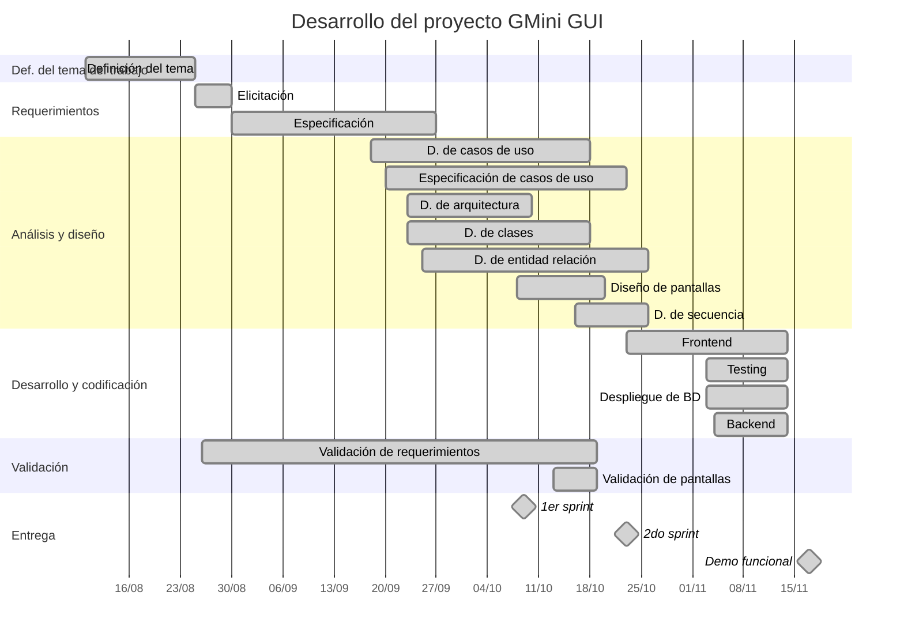

## CRONOGRAMA DE TRABAJO

### Visión general

```mermaid
gantt
    title Desarrollo del proyecto GMini GUI
    dateFormat YYYY-MM-DD
    axisFormat %d/%m

    section Def. del tema del trabajo
        Definición del tema             :done, def_tema, 2026-08-10, 15d

    section Requerimientos
        Elicitación                     :done, elicitacion, after def_tema, 5d
        Especificación                  :done, especificacion, after elicitacion, 28d

    section Análisis y diseño
        D. de casos de uso              :done, d_cu, 2026-09-18, 30d
        Especificación de casos de uso  :done, esp_cu, 2026-09-20, 33d
        D. de arquitectura              :done, d_arq, 2026-09-23, 17d
        D. de clases                    :done, d_clases, 2026-09-23, 25d
        D. de entidad relación          :done, d_er, 2026-09-25, 31d
        Diseño de pantallas             :done, dis_pantallas, 2026-10-08, 12d
        D. de secuencia                 :done, d_sec, 2026-10-16, 10d

    section Desarrollo y codificación
        Frontend                        :done, frontend, 2026-10-23, 22d
        Testing                         :done, testing, 2026-11-03, 11d
        Despliegue de BD                :done, bd, 2026-11-03, 11d
        Backend                         :done, backend, 2026-11-04, 10d

    section Validación
        Validación de requerimientos    :done, val_req, 2026-08-26, 54d
        Validación de pantallas         :done, val_pant, 2026-10-13, 6d

    section Entrega
        1er sprint                  :milestone, done, sprint1, 2026-10-09, 0d
        2do sprint                  :milestone, done, sprint2, 2026-10-23, 0d
        Demo funcional                  :milestone, done, demo, 2026-11-17, 0d
```

