#### Subsistema 3: Configuración y Gestión de Perfiles (Setups)

##### Módulo 1: Perfiles de Usuario y Gestión de Setups de Medición

##### Inicializar entorno de trabajo

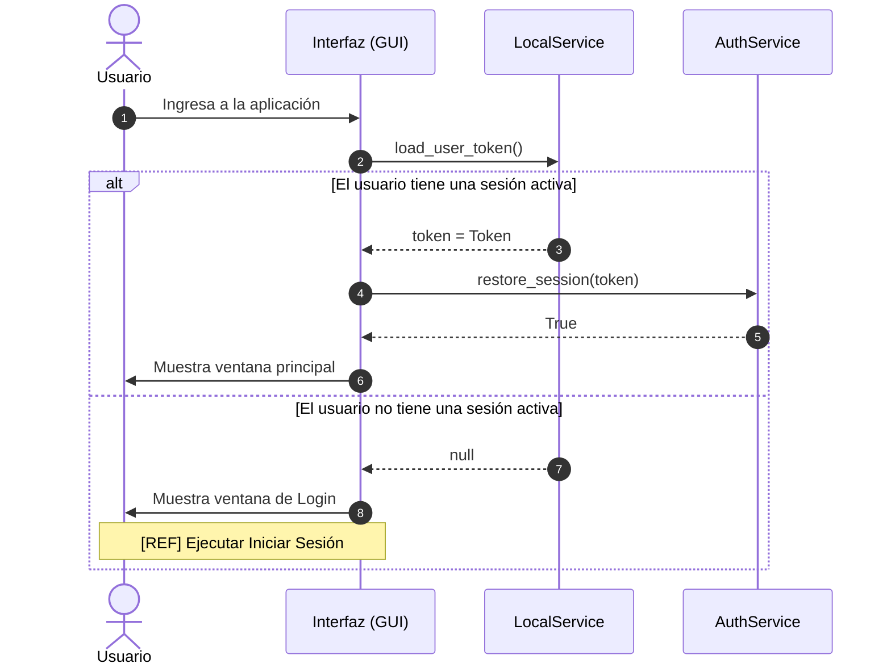
```mermaid
sequenceDiagram
autonumber

actor U as Usuario
participant G as Interfaz (GUI)
participant local as LocalService
participant auth as AuthService
U->>G: Ingresa a la aplicación
G->>local: load_user_token()

alt El usuario tiene una sesión activa

	local-->>G: token = Token
	G->>auth: restore_session(token)
	
	auth-->>G: True
	G->>U: Muestra ventana principal
	
else El usuario no tiene una sesión activa

	local-->>G: null
	G->>U: Muestra ventana de Login
	Note over U, G: [REF] Ejecutar Iniciar Sesión
	
end
```

##### Crear Perfil de Usuario

```mermaid
sequenceDiagram
autonumber

actor U as Usuario
participant G as Interfaz (GUI)
participant auth as AuthService


U->>G: Solicitud de Registro
G->>auth: register(user_name, email, password)


participant dbs as DataBaseService
participant db as Base de Datos

auth->>dbs: get_user_by_email(email)
dbs->>db: SELECT * FROM USER WHERE email = @email_param
alt Usuario Inexistente
	db-->>dbs: NULL
	dbs-->>auth: null
	auth->>auth: hashed_password = rehash_password(password)
	create participant user as User
	auth->>user: new User(user_name, email, hashed_password, null)
	user-->>auth: Instancia creada
	auth->>dbs: save_user(user : User)
	dbs->>db: INSERT INTO USER (user_name, email, password, root_directory) VALUES(user_name, email, hashed_password, null)
	db-->>dbs: Confirmacion de Guardado
	dbs->>db: SELECT last_insert_rowid()
	db-->>dbs: user_id
	dbs->>user: set_user_id(user_id)
	dbs-->>auth: Confirmacion de Guardado
	auth-->>G: True
	G-->>U: Registro exitoso
else El usuario existe
	db-->>dbs: USER.user_name, USER.email, USER.password, USER.root_directory
	dbs-->>auth: User
	auth-->>G: False
	G-->>U: Registro cancelado
end
```

##### Iniciar Sesión
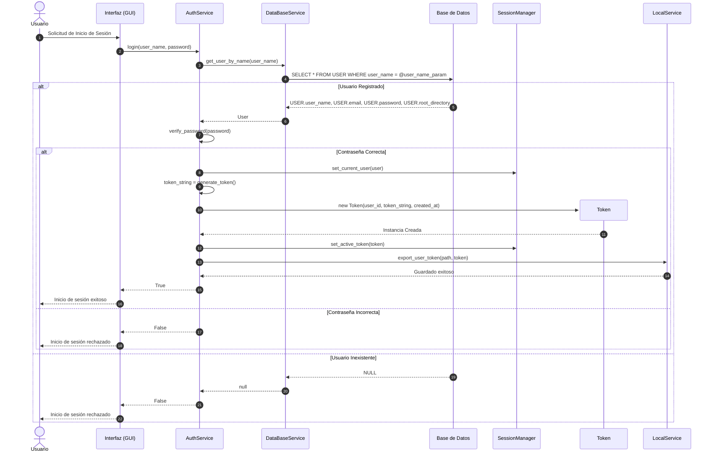
```mermaid
sequenceDiagram
autonumber

actor U as Usuario
participant G as Interfaz (GUI)
participant auth as AuthService

U->>G: Solicitud de Inicio de Sesión
G->>auth: login(user_name, password)
participant dbs as DataBaseService
participant db as Base de Datos
auth->>dbs: get_user_by_name(user_name)
dbs->>db: SELECT * FROM USER WHERE user_name = @user_name_param
alt Usuario Registrado
	db-->>dbs: USER.user_name, USER.email, USER.password, USER.root_directory
	dbs-->>auth: User
	auth->>auth: verify_password(password)
	alt Contraseña Correcta
		participant session as SessionManager
		auth->>session: set_current_user(user)
		auth->>auth: token_string = generate_token()
		create participant T as Token
		auth->>T: new Token(user_id, token_string, created_at)
		T-->>auth: Instancia Creada
		auth->>session: set_active_token(token)
		participant local as LocalService
		auth->>local: export_user_token(path, token)
		local-->>auth: Guardado exitoso
		auth-->>G: True
		G-->>U: Inicio de sesión exitoso
	
	else Contraseña Incorrecta
			auth-->>G: False
			G-->>U: Inicio de sesión rechazado
	end
	
else Usuario Inexistente
	db-->>dbs: NULL
	dbs-->>auth: null
	auth-->>G: False
	G-->>U: Inicio de sesión rechazado
end
```

##### Cerrar Sesión
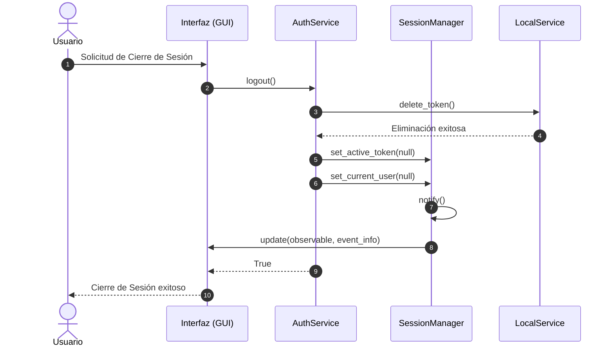
```mermaid
sequenceDiagram
autonumber

actor U as Usuario
participant G as Interfaz (GUI)
participant auth as AuthService
participant session as SessionManager
participant local as LocalService

U->>G: Solicitud de Cierre de Sesión
G->>auth: logout()
auth->>local: delete_token()
local-->>auth: Eliminación exitosa
auth->>session: set_active_token(null)
auth->>session: set_current_user(null)
session->>session: notify()
session->>G: update(observable, event_info)
auth-->>G: True
G-->>U: Cierre de Sesión exitoso


```

##### Crear sesion Experimental

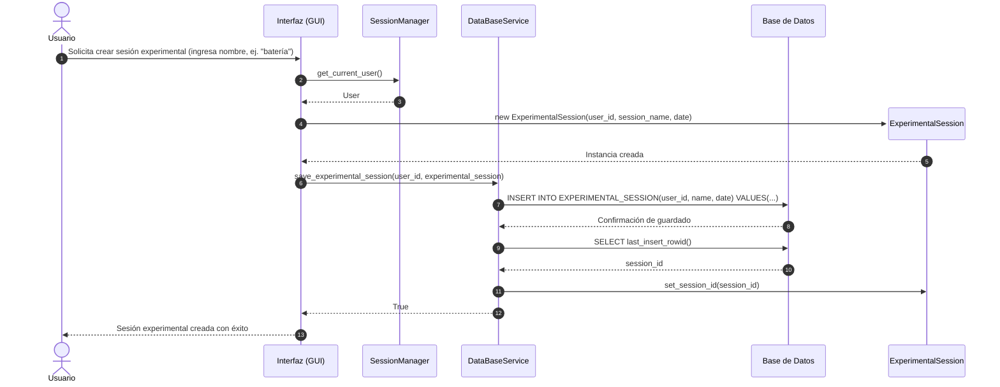
```mermaid
sequenceDiagram
autonumber

actor U as Usuario
participant G as Interfaz (GUI)
participant session as SessionManager
participant dbs as DataBaseService
participant db as Base de Datos

U->>G: Solicita crear sesión experimental (ingresa nombre, ej. "batería")
G->>session: get_current_user()
session-->>G: User

create participant ES as ExperimentalSession
G->>ES: new ExperimentalSession(user_id, session_name, date)
ES-->>G: Instancia creada

G->>dbs: save_experimental_session(user_id, experimental_session)
dbs->>db: INSERT INTO EXPERIMENTAL_SESSION(user_id, name, date) VALUES(...)
db-->>dbs: Confirmación de guardado

dbs->>db: SELECT last_insert_rowid()
db-->>dbs: session_id
dbs->>ES: set_session_id(session_id)

dbs-->>G: True
G-->>U: Sesión experimental creada con éxito

```

##### Importar AutoSecuencia
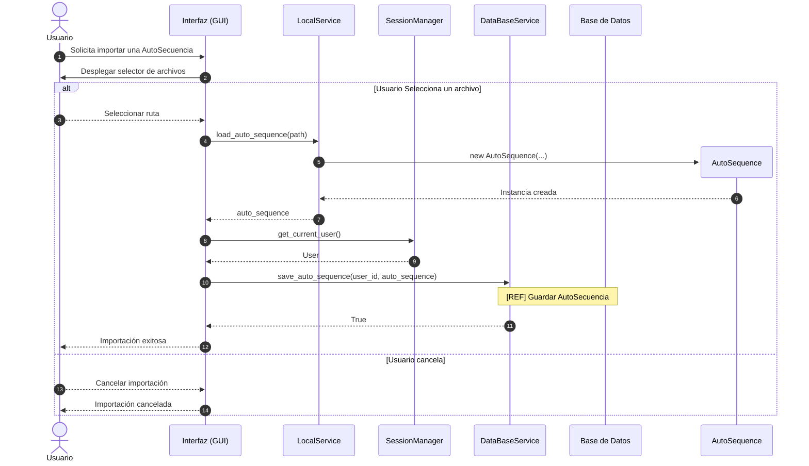
```mermaid

sequenceDiagram
autonumber

actor U as Usuario
participant G as Interfaz (GUI)
participant local as LocalService
participant session as SessionManager
participant dbs as DataBaseService
participant db as Base de Datos

U->>G: Solicita importar una AutoSecuencia
G->>U: Desplegar selector de archivos
alt Usuario Selecciona un archivo
	U-->>G: Seleccionar ruta
	G->>local: load_auto_sequence(path)
	create participant AS as AutoSequence
	local->>AS: new AutoSequence(...)
	AS-->>local: Instancia creada
	local-->>G: auto_sequence
	G->>session: get_current_user()
	session-->>G: User
	G->>dbs: save_auto_sequence(user_id, auto_sequence)
	Note over dbs, db: [REF] Guardar AutoSecuencia
	dbs-->>G: True
	G-->>U: Importación exitosa
else Usuario cancela
	U-->>G: Cancelar importación
	G-->>U: Importación cancelada
end

```

##### Exportar AutoSecuencia

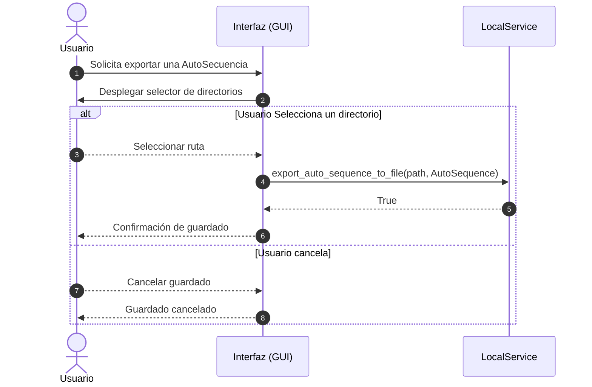
```mermaid

sequenceDiagram
autonumber

actor U as Usuario
participant G as Interfaz (GUI)
participant local as LocalService

U->>G: Solicita exportar una AutoSecuencia
G->>U: Desplegar selector de directorios
alt Usuario Selecciona un directorio
	U-->>G: Seleccionar ruta
	G->>local: export_auto_sequence_to_file(path, AutoSequence)
	local-->>G: True
	G-->>U: Confirmación de guardado
else Usuario cancela
	U-->>G: Cancelar guardado
	G-->>U: Guardado cancelado
end

```

##### Importar Sesión Experimental

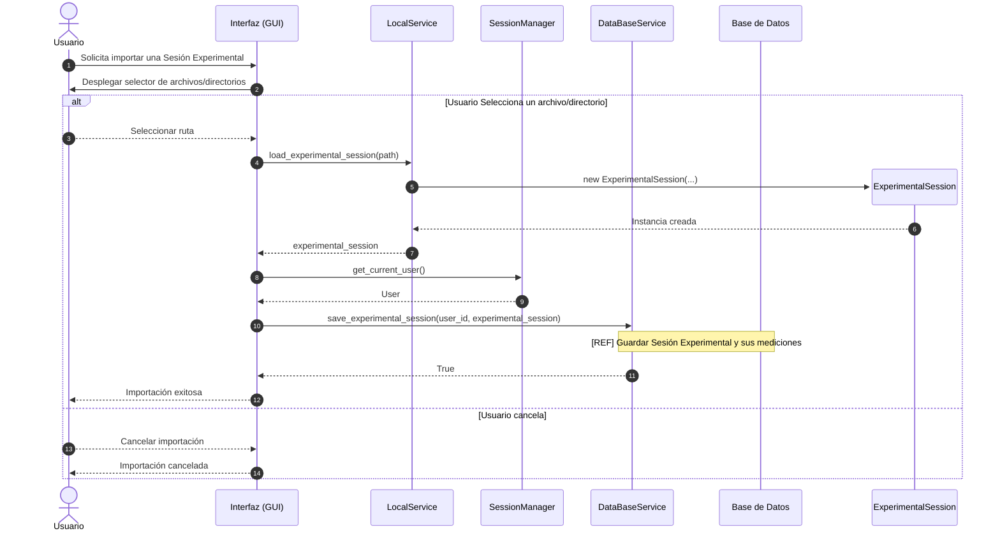
```mermaid

sequenceDiagram
autonumber

actor U as Usuario
participant G as Interfaz (GUI)
participant local as LocalService
participant session as SessionManager
participant dbs as DataBaseService
participant db as Base de Datos

U->>G: Solicita importar una Sesión Experimental
G->>U: Desplegar selector de archivos/directorios
alt Usuario Selecciona un archivo/directorio
	U-->>G: Seleccionar ruta
	G->>local: load_experimental_session(path)
	create participant ES as ExperimentalSession
	local->>ES: new ExperimentalSession(...)
	ES-->>local: Instancia creada
	local-->>G: experimental_session
	G->>session: get_current_user()
	session-->>G: User
	G->>dbs: save_experimental_session(user_id, experimental_session)
	Note over dbs, db: [REF] Guardar Sesión Experimental y sus mediciones 
	dbs-->>G: True
	G-->>U: Importación exitosa
else Usuario cancela
	U-->>G: Cancelar importación
	G-->>U: Importación cancelada
end

```

##### Exportar Sesión Experimental

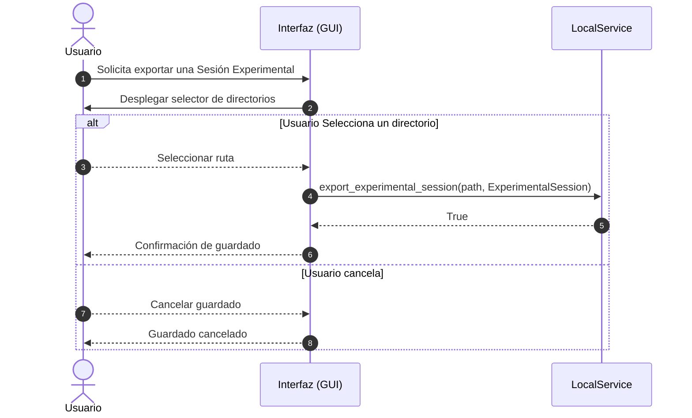
```mermaid

sequenceDiagram
autonumber

actor U as Usuario
participant G as Interfaz (GUI)
participant local as LocalService

U->>G: Solicita exportar una Sesión Experimental
G->>U: Desplegar selector de directorios
alt Usuario Selecciona un directorio
	U-->>G: Seleccionar ruta
	G->>local: export_experimental_session(path, ExperimentalSession)
	local-->>G: True
	G-->>U: Confirmación de guardado
else Usuario cancela
	U-->>G: Cancelar guardado
	G-->>U: Guardado cancelado
end

```

##### Exportar Medición

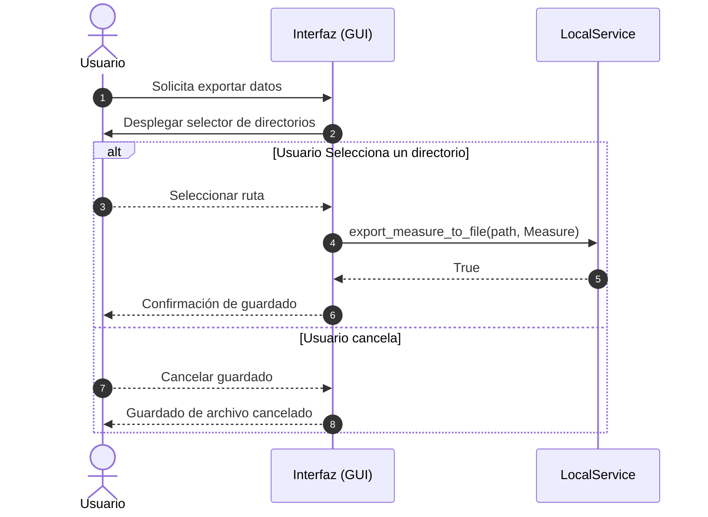
```mermaid
sequenceDiagram
autonumber

actor U as Usuario
participant G as Interfaz (GUI)
participant local as LocalService

U->>G: Solicita exportar datos
G->>U: Desplegar selector de directorios
alt Usuario Selecciona un directorio
	U-->>G: Seleccionar ruta
	G->>local: export_measure_to_file(path, Measure)
	local-->>G: True
	G-->>U: Confirmación de guardado
else Usuario cancela
	U-->>G: Cancelar guardado
	G-->>U: Guardado de archivo cancelado
end
```

##### Exportar Configuración

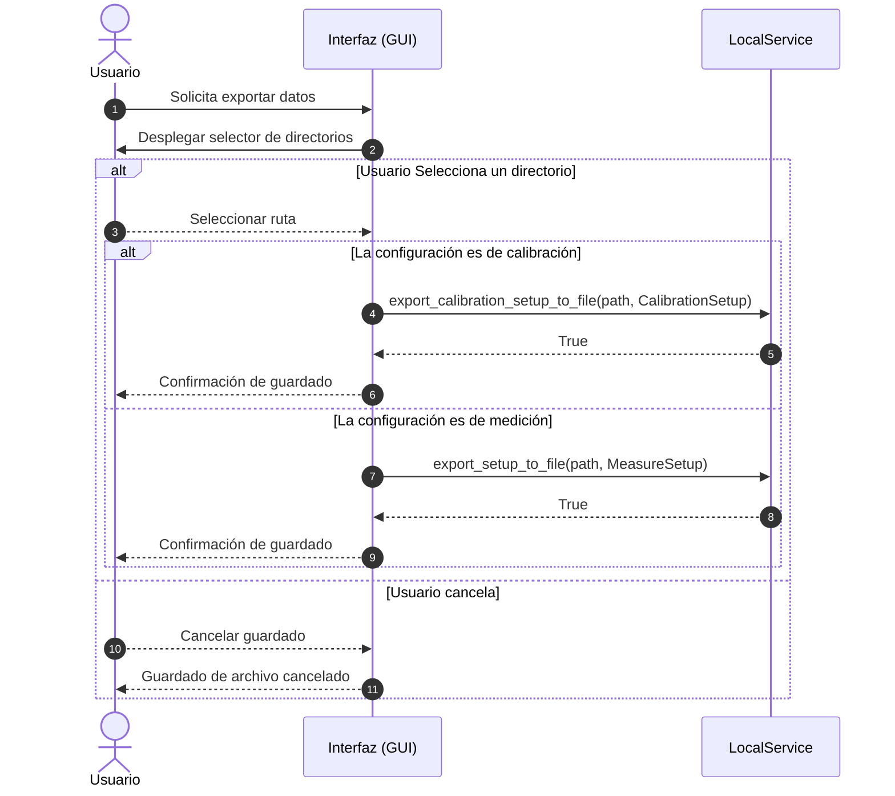
```mermaid
sequenceDiagram
autonumber

actor U as Usuario
participant G as Interfaz (GUI)
participant local as LocalService

U->>G: Solicita exportar datos
G->>U: Desplegar selector de directorios
alt Usuario Selecciona un directorio
	U-->>G: Seleccionar ruta
	alt La configuración es de calibración
		G->>local: export_calibration_setup_to_file(path, CalibrationSetup)
		local-->>G: True
		G-->>U: Confirmación de guardado
	else La configuración es de medición
		G->>local: export_setup_to_file(path, MeasureSetup)
		local-->>G: True
		G-->>U: Confirmación de guardado
	end
else Usuario cancela
	U-->>G: Cancelar guardado
	G-->>U: Guardado de archivo cancelado
end
```

##### Importar Configuración

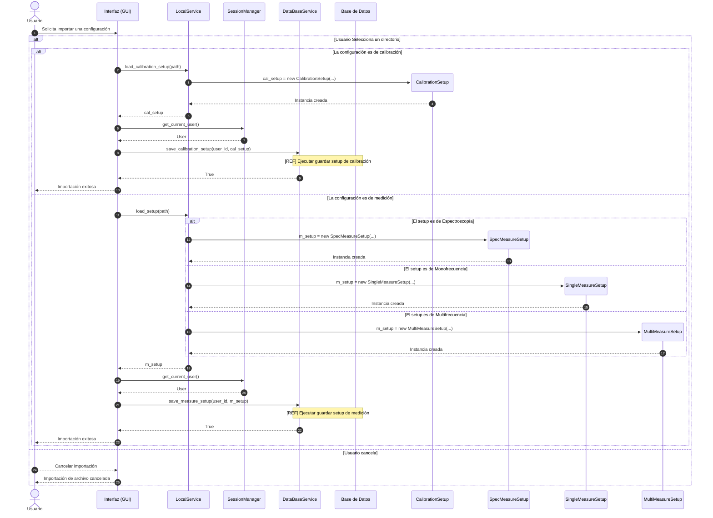
```mermaid
sequenceDiagram
autonumber

actor U as Usuario
participant G as Interfaz (GUI)
participant local as LocalService
participant session as SessionManager
participant dbs as DataBaseService
participant db as Base de Datos

U->>G: Solicita importar una configuración
	alt Usuario Selecciona un directorio
	alt La configuración es de calibración
			G->>local: load_calibration_setup(path)
			create participant C as CalibrationSetup
			local->>C: cal_setup = new CalibrationSetup(...)
			C-->>local: Instancia creada
			local-->>G: cal_setup
			G->>session: get_current_user()
			session-->>G: User
			G->>dbs: save_calibration_setup(user_id, cal_setup)
			Note over dbs, db: [REF] Ejecutar guardar setup de calibración
			dbs-->>G: True
			G-->>U: Importación exitosa
	else La configuración es de medición	
		G->>local: load_setup(path)
		alt El setup es de Espectroscopía
			create participant spec as SpecMeasureSetup
			local->>spec: m_setup = new SpecMeasureSetup(...)
			spec-->>local: Instancia creada
		else El setup es de Monofrecuencia
			create participant single as SingleMeasureSetup
			local->>single: m_setup = new SingleMeasureSetup(...)
			single-->>local: Instancia creada
		else El setup es de Multifrecuencia
			create participant multi as MultiMeasureSetup
			local->>multi: m_setup = new MultiMeasureSetup(...)
			multi-->>local: Instancia creada
		end
		local-->>G: m_setup
		G->>session: get_current_user()
		session-->>G: User
		G->>dbs: save_measure_setup(user_id, m_setup)
		Note over dbs, db: [REF] Ejecutar guardar setup de medición
		dbs-->>G: True
		G-->>U: Importación exitosa
	end
	else Usuario cancela
		U-->>G: Cancelar importación
		G-->>U: Importación de archivo cancelada
	end
```

##### Importar Medición
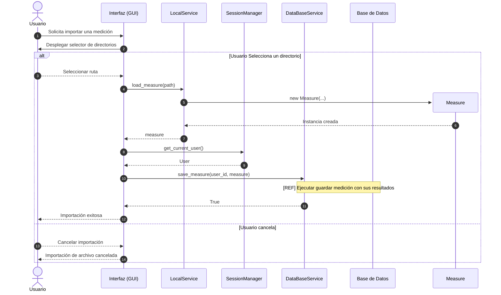
```mermaid
sequenceDiagram
autonumber

actor U as Usuario
participant G as Interfaz (GUI)
participant local as LocalService
participant session as SessionManager
participant dbs as DataBaseService
participant db as Base de Datos

U->>G: Solicita importar una medición

G->>U: Desplegar selector de directorios
	alt Usuario Selecciona un directorio
		U-->>G: Seleccionar ruta
		G->>local: load_measure(path)
		create participant M as Measure
		local->>M: new Measure(...)
		M-->>local: Instancia creada
		local-->>G: measure
		G->>session: get_current_user()
			session-->>G: User
			G->>dbs: save_measure(user_id, measure)
			Note over dbs, db: [REF] Ejecutar guardar medición con sus resultados
			dbs-->>G: True
			G-->>U: Importación exitosa
	else Usuario cancela
		U-->>G: Cancelar importación
		G-->>U: Importación de archivo cancelada
	end
```

#### Subsistema 5: Persistencia

##### Módulo 1: Almacenamiento y Estructura de Datos

##### Configurar directorio raíz
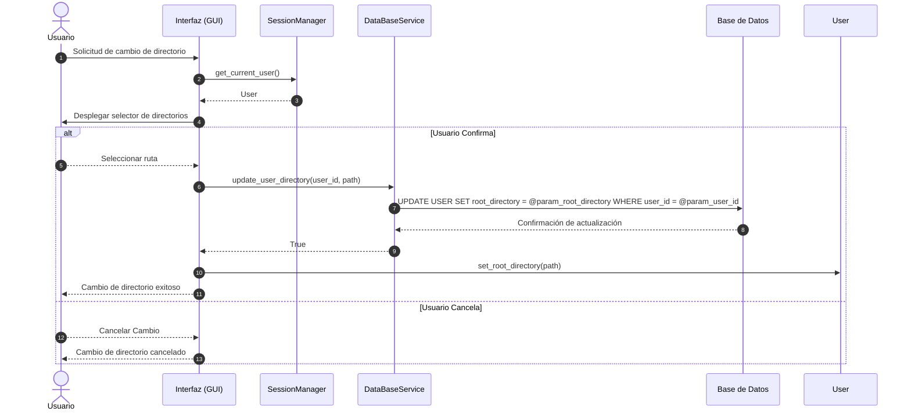
```mermaid
sequenceDiagram
autonumber

actor U as Usuario
participant G as Interfaz (GUI)
participant session as SessionManager
participant dbs as DataBaseService
participant db as Base de Datos
participant user as User

U->>G: Solicitud de cambio de directorio
G->>session: get_current_user()
session-->>G: User
G->>U: Desplegar selector de directorios
alt Usuario Confirma
	U-->>G: Seleccionar ruta
	G->>dbs: update_user_directory(user_id, path)
	dbs->>db: UPDATE USER SET root_directory = @param_root_directory WHERE user_id = @param_user_id
	db-->>dbs: Confirmación de actualización
	dbs-->>G: True
	G->>user: set_root_directory(path)
	G-->>U: Cambio de directorio exitoso
else Usuario Cancela
	U-->>G: Cancelar Cambio
	G-->>U: Cambio de directorio cancelado
end
```

##### Guardar mediciones con sus resultados
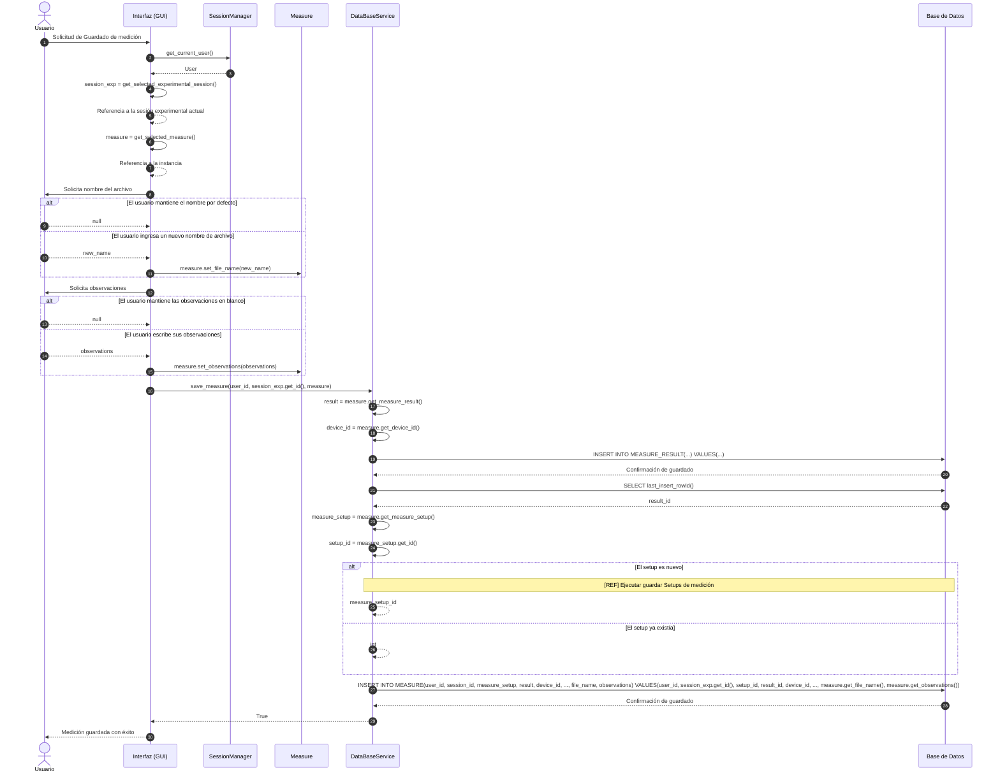
```mermaid
sequenceDiagram
autonumber

actor U as Usuario
participant G as Interfaz (GUI)
participant session as SessionManager
participant M as Measure

U->>G: Solicitud de Guardado de medición
G->>session: get_current_user()
session-->>G: User

%% NUEVO: Contexto de la Sesión Experimental
G->>G: session_exp = get_selected_experimental_session()
G-->>G: Referencia a la sesión experimental actual

G->>G: measure = get_selected_measure()
G-->>G: Referencia a la instancia

G->>U: Solicita nombre del archivo
alt El usuario mantiene el nombre por defecto
	U-->>G: null
else El usuario ingresa un nuevo nombre de archivo
	U-->>G: new_name
	G->>M: measure.set_file_name(new_name)
end

G->>U: Solicita observaciones
alt El usuario mantiene las observaciones en blanco
	U-->>G: null
else El usuario escribe sus observaciones
	U-->>G: observations
	G->>M: measure.set_observations(observations)
end

participant dbs as DataBaseService
participant db as Base de Datos

%% NUEVO: Se pasa el ID de la sesión al servicio
G->>dbs: save_measure(user_id, session_exp.get_id(), measure)
dbs->>dbs: result = measure.get_measure_result()
dbs->>dbs: device_id = measure.get_device_id()

dbs->>db: INSERT INTO MEASURE_RESULT(...) VALUES(...)
db-->>dbs: Confirmación de guardado
dbs->>db: SELECT last_insert_rowid()
db-->>dbs: result_id

dbs->>dbs: measure_setup = measure.get_measure_setup()
dbs->>dbs: setup_id = measure_setup.get_id()
alt El setup es nuevo
	Note over dbs, db: [REF] Ejecutar guardar Setups de medición
	dbs-->>dbs: measure_setup_id
else El setup ya existía
	dbs-->>dbs: int
end

%% NUEVO: Inserción incluyendo session_id
dbs->>db: INSERT INTO MEASURE(user_id, session_id, measure_setup, result, device_id, ..., file_name, observations) VALUES(user_id, session_exp.get_id(), setup_id, result_id, device_id, ..., measure.get_file_name(), measure.get_observations())
db-->>dbs: Confirmación de guardado
dbs-->>G: True
G-->>U: Medición guardada con éxito
```

##### Guardar Setups de calibración
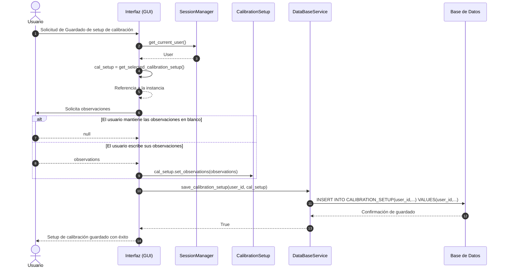
```mermaid
sequenceDiagram
autonumber

actor U as Usuario
participant G as Interfaz (GUI)
participant session as SessionManager
participant C as CalibrationSetup

U->>G: Solicitud de Guardado de setup de calibración
G->>session: get_current_user()
session-->>G: User
G->>G: cal_setup = get_selected_calibration_setup()
G-->>G: Referencia a la instancia

G->>U: Solicita observaciones
alt El usuario mantiene las observaciones en blanco
	U-->>G: null
else El usuario escribe sus observaciones
	U-->>G: observations
	G->>C: cal_setup.set_observations(observations)
end

participant dbs as DataBaseService
participant db as Base de Datos

G->>dbs: save_calibration_setup(user_id, cal_setup)
dbs->>db: INSERT INTO CALIBRATION_SETUP(user_id,...) VALUES(user_id,...)
db-->>dbs: Confirmación de guardado
dbs-->>G: True
G-->>U: Setup de calibración guardado con éxito
```

##### Guardar Setups de medición

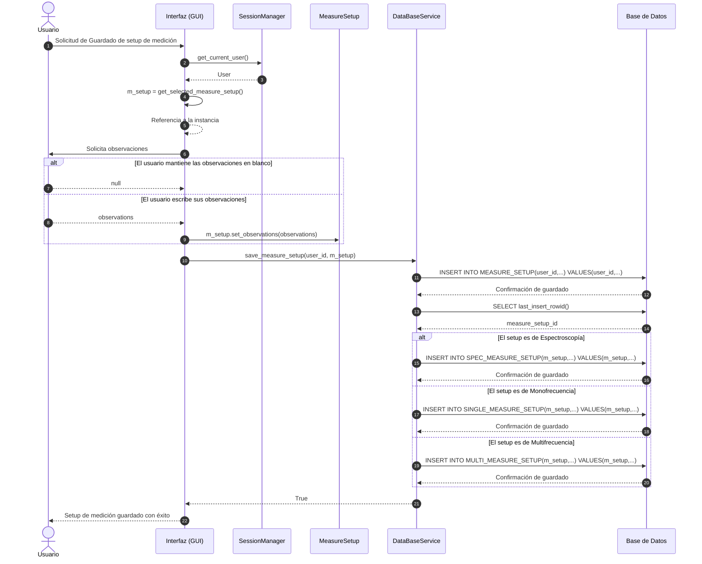
```mermaid
sequenceDiagram
autonumber

actor U as Usuario
participant G as Interfaz (GUI)
participant session as SessionManager
participant MS as MeasureSetup

U->>G: Solicitud de Guardado de setup de medición
G->>session: get_current_user()
session-->>G: User
G->>G: m_setup = get_selected_measure_setup()
G-->>G: Referencia a la instancia

G->>U: Solicita observaciones
alt El usuario mantiene las observaciones en blanco
	U-->>G: null
else El usuario escribe sus observaciones
	U-->>G: observations
	G->>MS: m_setup.set_observations(observations)
end

participant dbs as DataBaseService
participant db as Base de Datos

G->>dbs: save_measure_setup(user_id, m_setup)
dbs->>db: INSERT INTO MEASURE_SETUP(user_id,...) VALUES(user_id,...)
	db-->>dbs: Confirmación de guardado
	
	dbs->>db: SELECT last_insert_rowid()
	db-->>dbs: measure_setup_id
	
	alt El setup es de Espectroscopía
		dbs->>db: INSERT INTO SPEC_MEASURE_SETUP(m_setup,...) VALUES(m_setup,...)
		db-->>dbs: Confirmación de guardado
	else El setup es de Monofrecuencia
		dbs->>db: INSERT INTO SINGLE_MEASURE_SETUP(m_setup,...) VALUES(m_setup,...)
		db-->>dbs: Confirmación de guardado
	else El setup es de Multifrecuencia
		dbs->>db: INSERT INTO MULTI_MEASURE_SETUP(m_setup,...) VALUES(m_setup,...)
		db-->>dbs: Confirmación de guardado
	end
dbs-->>G: True
G-->>U: Setup de medición guardado con éxito
```

##### Exportar gráficas generadas
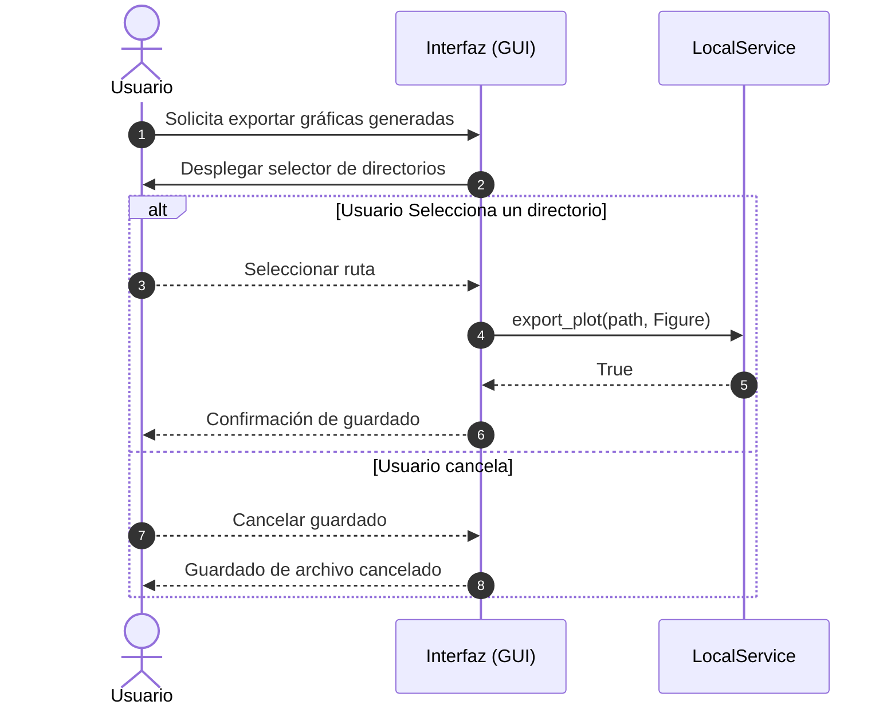
```mermaid
sequenceDiagram
autonumber

actor U as Usuario
participant G as Interfaz (GUI)
participant local as LocalService

U->>G: Solicita exportar gráficas generadas
G->>U: Desplegar selector de directorios
alt Usuario Selecciona un directorio
	U-->>G: Seleccionar ruta
	G->>local: export_plot(path, Figure)
	local-->>G: True
	G-->>U: Confirmación de guardado
	
else Usuario cancela
	U-->>G: Cancelar guardado
	G-->>U: Guardado de archivo cancelado
end
```

##### Configurar Setup de Medicion

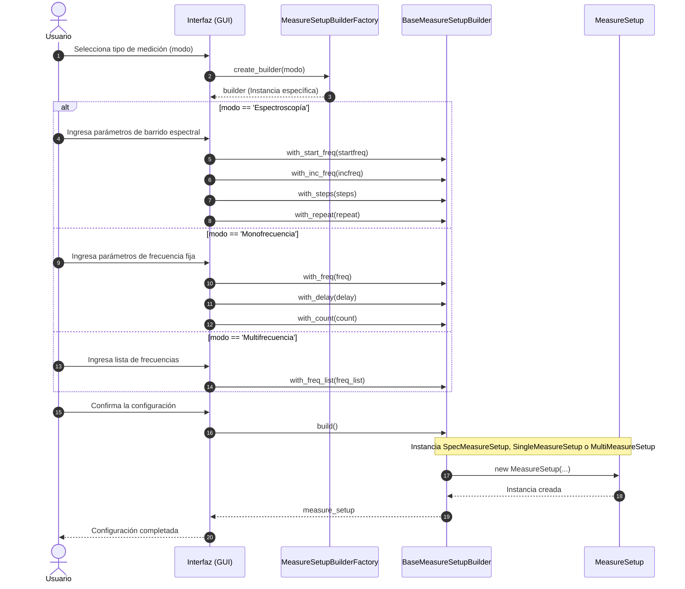
```mermaid
sequenceDiagram
autonumber

actor U as Usuario
participant G as Interfaz (GUI)
participant F as MeasureSetupBuilderFactory
participant B as BaseMeasureSetupBuilder

U->>G: Selecciona tipo de medición (modo)
G->>F: create_builder(modo)
F-->>G: builder (Instancia específica)

alt modo == 'Espectroscopía'
    U->>G: Ingresa parámetros de barrido espectral
    G->>B: with_start_freq(startfreq)
    G->>B: with_inc_freq(incfreq)
    G->>B: with_steps(steps)
    G->>B: with_repeat(repeat)
else modo == 'Monofrecuencia'
    U->>G: Ingresa parámetros de frecuencia fija
    G->>B: with_freq(freq)
    G->>B: with_delay(delay)
    G->>B: with_count(count)
else modo == 'Multifrecuencia'
    U->>G: Ingresa lista de frecuencias
    G->>B: with_freq_list(freq_list)
end

U->>G: Confirma la configuración
G->>B: build()
create participant MS as MeasureSetup
Note over B, MS: Instancia SpecMeasureSetup, SingleMeasureSetup o MultiMeasureSetup
B->>MS: new MeasureSetup(...)
MS-->>B: Instancia creada
B-->>G: measure_setup
G-->>U: Configuración completada

```
