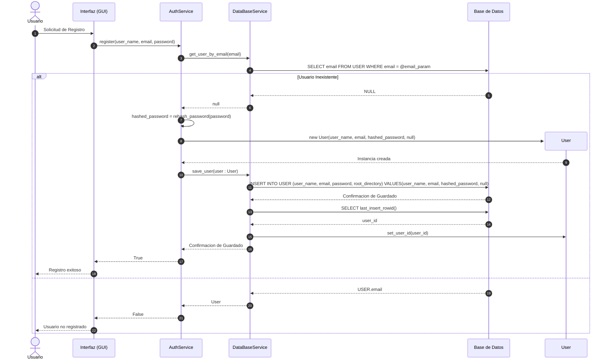

#### Subsistema 3: Configuración y Gestión de Perfiles (Setups)

##### Módulo 1: Perfiles de Usuario y Gestión de Setups de Medición

##### Crear Perfil de Usuario

```mermaid
sequenceDiagram
autonumber

actor U as Usuario
participant G as Interfaz (GUI)
participant auth as AuthService


U->>G: Solicitud de Registro
G->>auth: register(user_name, email, password)


participant dbs as DataBaseService
participant db as Base de Datos

auth->>dbs: get_user_by_email(email)
dbs->>db: SELECT email FROM USER WHERE email = @email_param
alt Usuario Inexistente
	db-->>dbs: NULL
	dbs-->>auth: null
	auth->>auth: hashed_password = rehash_password(password)
	create participant user as User
	auth->>user: new User(user_name, email, hashed_password, null)
	user-->>auth: Instancia creada
	auth->>dbs: save_user(user : User)
	dbs->>db: INSERT INTO USER (user_name, email, password, root_directory) VALUES(user_name, email, hashed_password, null)
	db-->>dbs: Confirmacion de Guardado
	dbs->>db: SELECT last_insert_rowid()
	db-->>dbs: user_id
	dbs->>user: set_user_id(user_id)
	dbs-->>auth: Confirmacion de Guardado
	auth-->>G: True
	G-->>U: Registro exitoso
else
	db-->>dbs: USER.email
	dbs-->>auth: User
	auth-->>G: False
	G-->>U: Usuario no registrado
end
```
