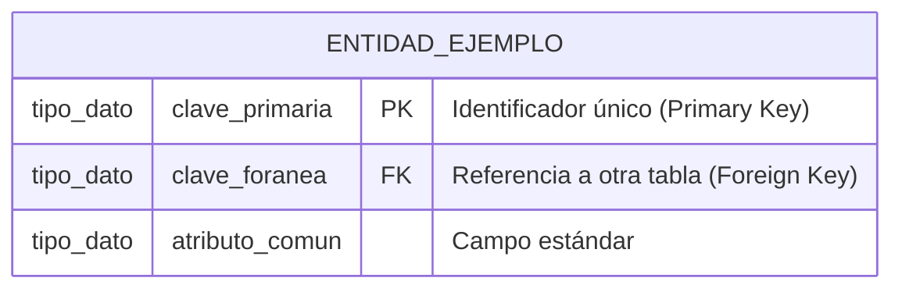
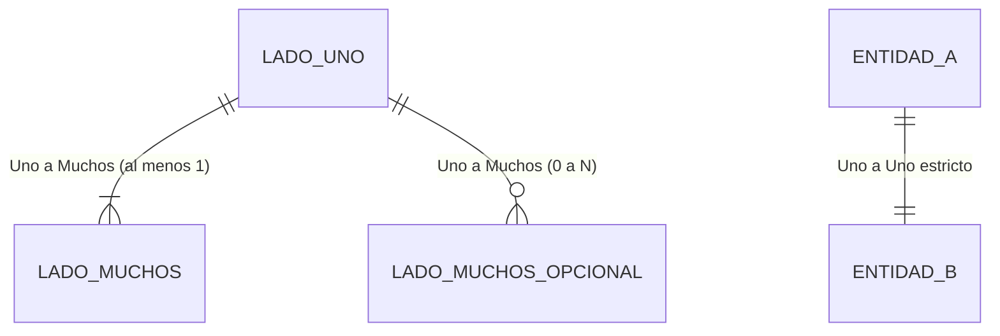
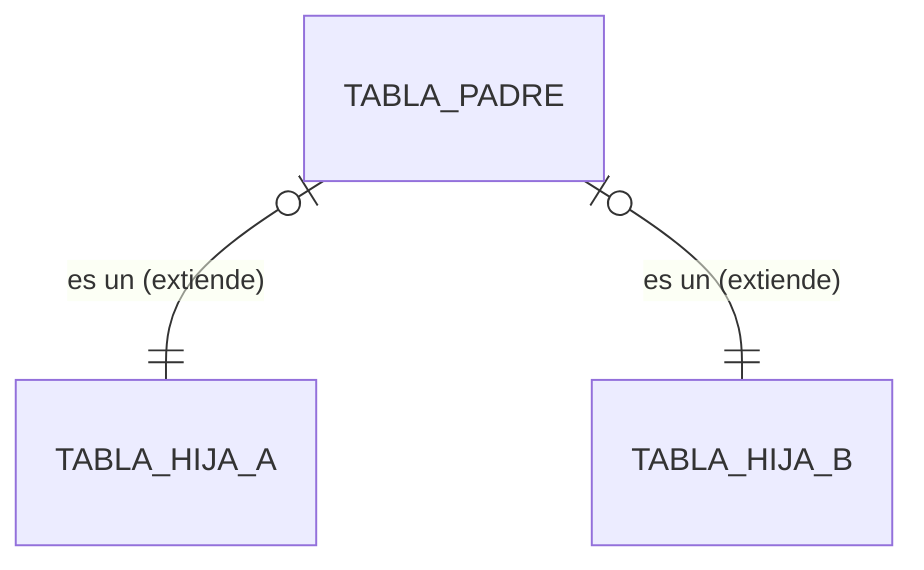
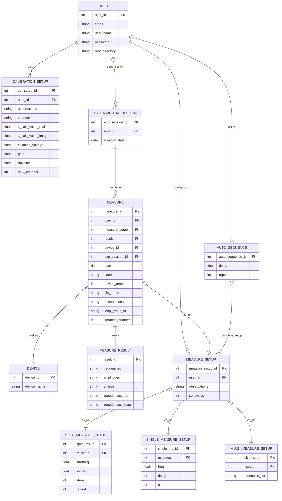

### Base de Datos

#### Convenciones Gráficas

##### Entidades, Atributos y Claves

```mermaid
erDiagram
    ENTIDAD_EJEMPLO {
        tipo_dato clave_primaria PK "Identificador único (Primary Key)"
        tipo_dato clave_foranea FK "Referencia a otra tabla (Foreign Key)"
        tipo_dato atributo_comun "Campo estándar"
    }
```

##### Cardinalidad y Multiplicidad

```mermaid
erDiagram
    LADO_UNO ||--|{ LADO_MUCHOS : "Uno a Muchos (al menos 1)"
    LADO_UNO ||--o{ LADO_MUCHOS_OPCIONAL : "Uno a Muchos (0 a N)"
    ENTIDAD_A ||--|| ENTIDAD_B : "Uno a Uno estricto"
```

##### Representación de Herencia

```mermaid
erDiagram
    TABLA_PADRE o|--|| TABLA_HIJA_A : "es un (extiende)"
    TABLA_PADRE o|--|| TABLA_HIJA_B : "es un (extiende)"
```

#### Diagrama de Entidad Relacion

```mermaid
erDiagram

USER{
	int user_id PK
	string email
	string user_name
	string password
	string root_directory
}

CALIBRATION_SETUP{
	int cal_setup_id PK
	int user_id FK
	string observations
	string channel
	float z_calc_value_real
	float z_calc_value_imag
	float exitation_voltage
	float gain
	float rfbvalue
	int mux_channel
}

MEASURE{
	int measure_id PK
	int user_id FK
	int measure_setup FK
	int result FK
	int device_id FK
	int exp_session_id FK
	date date
	string state
	float device_temp
	string file_name
	string observations
	string loop_group_id
	int iteration_number
}

DEVICE{
	int device_id PK
	string device_name
}

MEASURE_RESULT{
	int result_id PK
	string frequencies
	string amplitudes
	string phases
	string impedances_real
	string impedances_imag
}

MEASURE_SETUP{
	int measure_setup_id PK
	int user_id FK
	string observations
	int settcycles
}

SPEC_MEASURE_SETUP{
	int spec_ms_id PK
	int m_setup FK
	float startfreq
	float incfreq
	int steps
	int repeat
}

SINGLE_MEASURE_SETUP{
	int single_ms_id PK
	int m_setup FK
	float freq
	int delay
	int count
}

MULTI_MEASURE_SETUP{
	int multi_ms_id PK
	int m_setup FK
	string frequencies_list
}

EXPERIMENTAL_SESSION{
	int exp_session_id PK
	int user_id FK
	date creation_date
}

AUTO_SEQUENCE{
	int auto_sequence_id PK
	float delay
	int repeat
}

USER ||--o{ EXPERIMENTAL_SESSION : tiene_sesion

EXPERIMENTAL_SESSION ||--o{ MEASURE : contiene

USER ||--o{ CALIBRATION_SETUP : crea

USER ||--o{ AUTO_SEQUENCE : utiliza

USER ||--o{ MEASURE_SETUP : configura

MEASURE ||--|| MEASURE_RESULT : arroja

MEASURE |{--|| MEASURE_SETUP : tiene

MEASURE o{--|| DEVICE : realiza

AUTO_SEQUENCE o{--|{ MEASURE_SETUP : contiene_setup

MEASURE_SETUP o|--|| SPEC_MEASURE_SETUP : es_un
MEASURE_SETUP o|--|| SINGLE_MEASURE_SETUP : es_un
MEASURE_SETUP o|--|| MULTI_MEASURE_SETUP : es_un
```

