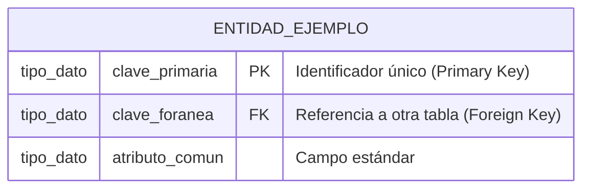
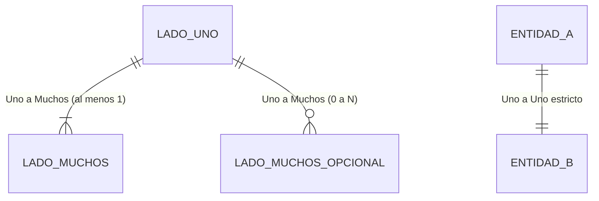
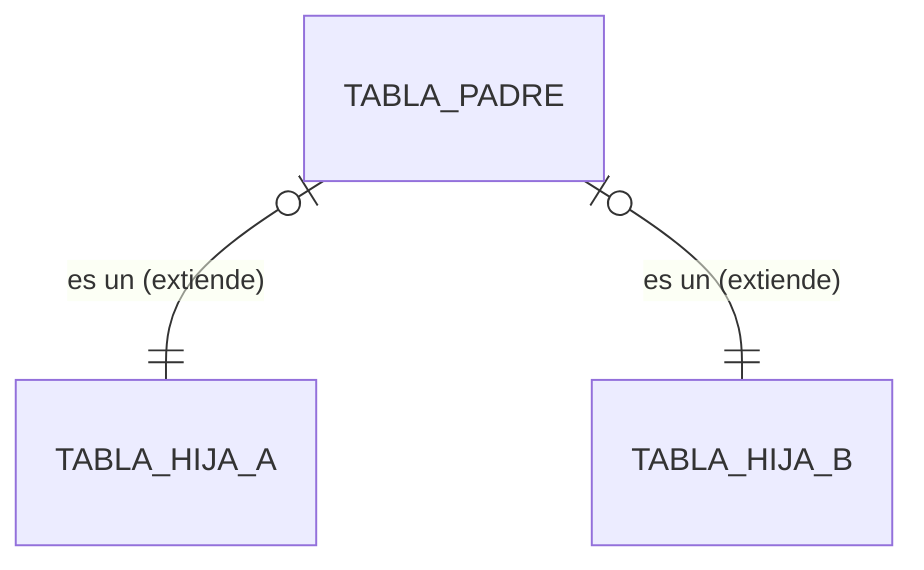
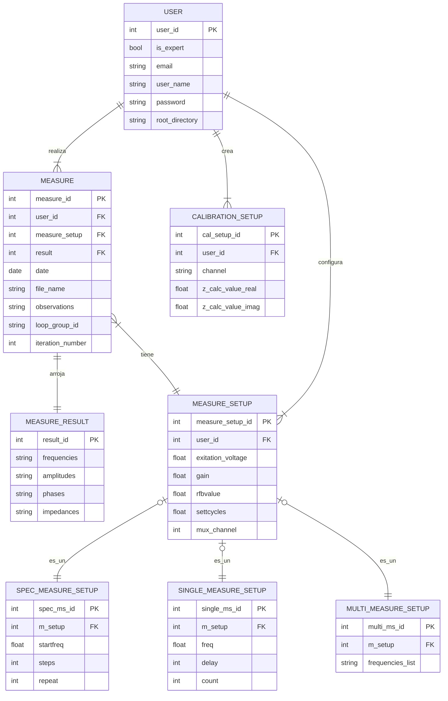

## BASE DE DATOS

### Convenciones Gráficas

#### Entidades, Atributos y Claves

```mermaid
erDiagram
    ENTIDAD_EJEMPLO {
        tipo_dato clave_primaria PK "Identificador único (Primary Key)"
        tipo_dato clave_foranea FK "Referencia a otra tabla (Foreign Key)"
        tipo_dato atributo_comun "Campo estándar"
    }
```

#### Cardinalidad y Multiplicidad

```mermaid
erDiagram
    LADO_UNO ||--|{ LADO_MUCHOS : "Uno a Muchos (al menos 1)"
    LADO_UNO ||--o{ LADO_MUCHOS_OPCIONAL : "Uno a Muchos (0 a N)"
    ENTIDAD_A ||--|| ENTIDAD_B : "Uno a Uno estricto"
```

#### Representación de Herencia

```mermaid
erDiagram
    TABLA_PADRE o|--|| TABLA_HIJA_A : "es un (extiende)"
    TABLA_PADRE o|--|| TABLA_HIJA_B : "es un (extiende)"
```

### Diagrama de Entidad Relacion

```mermaid
erDiagram

USER{
	int user_id PK
	bool is_expert
	string email
	string user_name
	string password
	string root_directory
}

CALIBRATION_SETUP{
	int cal_setup_id PK
	int user_id FK
	string channel
	float z_calc_value_real
	float z_calc_value_imag
}

MEASURE{
	int measure_id PK
	int user_id FK
	int measure_setup FK
	int result FK
	date date
	string file_name
	string observations
	string loop_group_id
	int iteration_number
}

MEASURE_RESULT{
	int result_id PK
	string frequencies
	string amplitudes
	string phases
	string impedances
}

MEASURE_SETUP{
	int measure_setup_id PK
	int user_id FK
	float exitation_voltage
	float gain
	float rfbvalue
	float settcycles
	int mux_channel
}

SPEC_MEASURE_SETUP{
	int spec_ms_id PK
	int m_setup FK
	float startfreq
	int steps
	int repeat
}

SINGLE_MEASURE_SETUP{
	int single_ms_id PK
	int m_setup FK
	float freq
	int delay
	int count
}

MULTI_MEASURE_SETUP{
	int multi_ms_id PK
	int m_setup FK
	string frequencies_list
}

USER ||--|{ MEASURE : realiza

USER ||--|{ CALIBRATION_SETUP : crea

USER ||--|{ MEASURE_SETUP : configura

MEASURE ||--|| MEASURE_RESULT : arroja

MEASURE |{--|| MEASURE_SETUP : tiene

MEASURE_SETUP o|--|| SPEC_MEASURE_SETUP : es_un
MEASURE_SETUP o|--|| SINGLE_MEASURE_SETUP : es_un
MEASURE_SETUP o|--|| MULTI_MEASURE_SETUP : es_un
```

